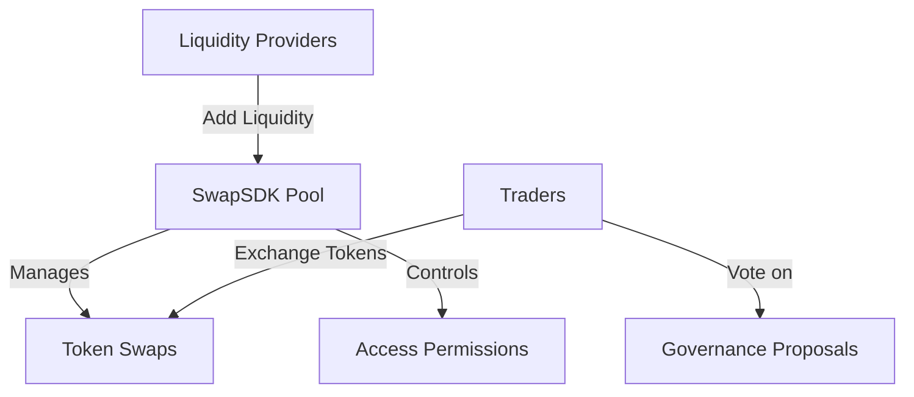

# SwapSDK: Decentralized Token Liquidity Protocol

## 🌊 Overview

SwapSDK is a cutting-edge decentralized token swap and liquidity management protocol built on the Stacks blockchain. Our smart contract provides a robust, secure, and flexible mechanism for token exchanges and liquidity provision.

## 🔍 Key Features

- Token swap functionality
- Liquidity pool management
- Governance and proposal system
- Secure access controls
- Transparent transaction tracking

## 💡 Use Cases

- Decentralized token trading
- Liquidity provision
- Cross-token exchanges
- Community-driven governance

## 🛠 Technical Architecture

SwapSDK leverages Clarity's smart contract capabilities to create a transparent and immutable token exchange ecosystem. The core contract (`swap-pool.clar`) manages:

- Token pool registrations
- Access control mechanisms
- Voting and governance proposals



## 📦 Installation

```bash
clarinet check     # Verify contract
clarinet console   # Interact with contract
```

## 🚀 Quick Start

```clarity
;; Example token swap
(access-paid-dataset "unique-token-pair")
```

## 👥 Contributing

1. Fork the repository
2. Create a feature branch
3. Commit your changes
4. Push and create a pull request

## 📄 License

MIT License